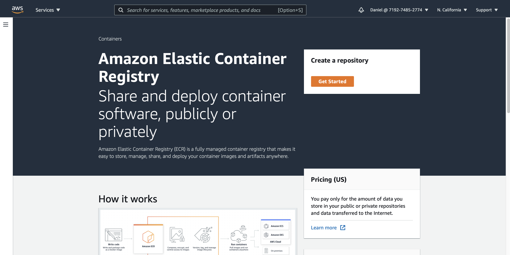

# Deploying health UI in AWS (free tier)

## Contents

- [Introduction](#introduction)
- [Pre-requisites](#pre-requisites)
- [Health UI](#health-ui)
- [Elastic Container Registry](#elastic-container-registry)
  - [Pushing health ui image](#pushing-health-ui-image)
- [Elastic Container Service](#elastic-container-servide)
  - [Crealing your cluster](#creating-your-cluster)
- [Deploying Health UI](#deploying-health-ui)
  - [Creating Health UI Task Definition](#creating-health-ui-task)
  - [Creating Health UI Service](#creating-cluster-service)
- [Cleanning up](#cleanning-up)

## Introduction

Amazon Web Services is one of the most popular cloud providers, and, as any other, it offers solutions for all the stages of a DevOps Cycle.

AWS provides a repository to store container images (ECR), a place to run for these containers in the cloud (ECS) or even serverless (AWS Fargate).
This document is intented to guide you through deploying the health ui microservice as done in the workshops, but this time using an AWS account (free tier).

This is not intented to dig deep into AWS cloud concepts, besides what is required to deploy your first containers, so please follow the links in this document for further information, and complete the pre-requisites below.
Remember that we are going to use a personal aws account, so even when all the lab activities are covered by the free tier limits, If you are not careful you could get unexpected costs.

## Pre-requisites

- AWS account and user.
- AWS CLI installed and configured in your workstation
- Basic undestanding of IAM users and roles, and AWS CLI

If you are new in AWS, check out the __video #3 in the section 1__(2 mins.), __section 3: Getting started in AWS__(13 mins.) and __section 4: IAM & AWS CLI__(53 mins.) of this [udemy course](https://ibm-learning.udemy.com/course/aws-certified-developer-associate-dva-c01/learn/lecture/26100712#overview)

## Health UI

In order to work with the application in your workkstation, you need to have the repository cloned or copied somehow locally.
We are going to build the health ui image locally, then push it to ECR and from there, we will be able to pull it and deploy it in an ECS cluster that we will have creted previously.

## Elastic Container Registry

The Elastic Container Registry (ECR) is repository to store container images, like dockerhub, but in AWS.

### Creating ECR repository

We will need to create a new repository in order to push our health-ui container image.

For this step, you can navigate to the ECR page in the AWS console, or use the AWS CLI.

To create the repository in the AWS console, just navigate using the search bar in the top of the page, and write ecr. Choose __Elastic Container Registry__ service just like the image below.

This will take you to the ECR landing page

click on "get started" to create your repository.

Then we will see a page with 3 secctions: "General Settings", "Image Scan Settings" and "Encryption Settings".

__General Settings__: Here we will select the visibility of our repository and the name we are going to use. The tag inmutability is useful If you want to avoid re writing an image when pushing another with the same tag, we'll leave it disabled, since we don't need to upload multiple images for this laboratory.

__Image scan settings__: AWS offers the oportunity to perform vulnerability scans against our images stored in ECR. This can be triggered either manually or automatically when an image is pushed. We are not going to dig deeper on this right now, but you can enable it If you want, AWS offers this service with no additional costs.

__Encryption settings__: By default, our images stored in ECR are not encrypted with KMS, we can configure it here. Since this will require additional configuration or costs and it's not on the scope of this laboratory we recommend to leave it disabled.

To create the repository using the CLI, since we have used all options by default, the command is very simple

    aws ecr create-repository \
            --repository-name health-ui

You will get an output like below:

In case you want to enable image tag inmutability, add the option like below:

    aws ecr create-repository \
            --repository-name health-ui \
            --image-tag-mutability IMMUTABLE

We can verify our repository has been created running:

    aws ecr describe-repositories

You should see now the configuration of your new ECR repository in a JSON format. Save your "repositoryUri", we are using it in the next step to login from docker.

> Note: This service is charged based on the storage used and data transfer to the internet. With the free tier, we have a limit of 500Mb of storage per month in private repositories, this is enough for this laboratory since images are compressed during the push, but be carefull not to exceed this limit. For more information about ECR price, go to [ECR pricing](https://aws.amazon.com/ecr/pricing/)

### Pushing health ui image

For this step, you will have to use the AWS CLI, since we are using docker to login to the repository we have created previosuly and to push the image we have built in the first labs of the bootcamp.

Frist thing we need to do is login to our newly created repository.

    aws ecr get-login-password --region <repositoryRegion> | docker login --username AWS --password-stdin <repositoryUri>

Replace "repositoryRegion" and "repositoryUri" with your own values and run the command. If everything is ok, you should see an output indicating "Login Succeeded".

Now that we have our image built and we have logged in our new AWS ECR repo, we have to tag our image to indicate the repo where it is gonig to be pushed to.

    docker tag <image name> <repositoryUri>:<tag>

    # for example:

    docker tag health-ui:latest 719274852774.dkr.ecr.us-west-1.amazonaws.com/health-ui:latest

Finally, we run docker push for our image, for example:

    docker push 719274852774.dkr.ecr.us-west-1.amazonaws.com/health-ui:latest

If you hare having trouble figuring out the commands to push the image to your repository, checkout the "view push commands" option in the AWS console.

Once the push is completed, we can confirm the upload was successfull running:

    aws ecr list-images --repository-name health-ui

You will see an image id in the output. You can also go and check in the aws console as well.

If you haven't enabled the option to automatically run image scan, we can trigger the scan manually. AWS allows you to run one scan per day, this includes the one triggered by the image push (if enabled).

    # example command
    aws ecr start-image-scan \
              --repository-name 719274852774.dkr.ecr.us-west-1.amazonaws.com/health-ui \
              --image-id imageDigest=sha256:f8c389d7babf154801582ac59cc6edcb3ad2334744f427dfca99ee54e483977e

It is possible to request the scan from the console as well, just go to your repository and click on the image tag you want to scan (in our case is the latest). You sill see the option in the top right of the screen.

## Elastic Container Service

Amazon Elastic Container Service (Amazon ECS) is a highly scalable and fast container management service that makes it easy to run, stop, and manage containers on a cluster.

ECS provides the options to create clusters based on aws EC2 instances, deploy containers serverless (AWS Fargate) of even add to ECS our on-premise clusters (ECS Anywhere).

In this lab, we are going to create a cluster, that will run in a single EC2 instance (t2.micro) to stay in the limits of the free tier.

### Crealing your cluster

As usual, this task can be performed from the aws console, or from the aws cli.

__From AWS Console__:

Use the search bar to write "ecs" and select the "Elastic Container Service" below the Services section.

If you see a different landing page, just enable the "new user experience" in the left of your screen.

Click on get started and create cluster in the right of the page.

AWS will ask you to choose netween the three options below:

__Networoking Only__:

We choose this option to create a cluster using existing infrastructure of serverless.

__EC2 Linux + Networking__:

We choos this option to deploy all required infrastructure by the cluster, a new VPC, Subnet and a auto scalling group. We will choose this one for the laboratory.

__EC2 Windows + Networking__:

This option is similar as the one above, but using windows instead of linux.

Select __EC2 Linux + Networking__ and click on next step.

In this step we need to specify the configuration of our instances, the networking options and IAM role. We won't be digging deep on this subject but if you want to know more about this, check __Section 15. ECS, ECR & Fargate - Docker in AWS__ of the [AWS Developer Course](https://ibm-learning.udemy.com/course/aws-certified-developer-associate-dva-c01/learn/lecture/13495740#content)

We are leaving almost all options by defualt, just make sure to apply the following:

- Write a cluster name that you can identify.
- Make sure "On demand instance" is selected and change the instance type to "t2.micro" (this is important if you want to stay in the free tier).
- Make sure the number of instance is 1.
- In networking, make sure "create a new vpc" is selected, leave all configuration by default.
- In order for the cluster to perform tasks as expected, we require an IAM role that will allow this actions, AWS will create a role for us, named "ecsInstanceRole".

This this done, click on create.

AWS will start creating all the resources using cloud formation.

This might take one or two minutes to be completed. Once is done, a new Cloud Formation Stack will be created. To read more about CloudFormation Stacks go to [aws documentation](https://docs.aws.amazon.com/AWSCloudFormation/latest/UserGuide/stacks.html)

Click on view cluster.

<!-- TODO: Add AWS CLI custer creation using cloudformation template -->

There are a few concepts that might be worth to clarify. In ECS we have created a cluster, this is formed by a set of one or mor ec2 instances with inside a private vpc and with a set of networking rules.

We have defined an IAM role that will allow our cluster setup to access and modify attibutes related to it's ec2 instances as required. Our cluster will manage the tasks we deploy and balance the containers that we configure between the different instances.

A task is like a deployment in kubernetes, here we will define the image that we will use and the replication configuration for the containers. A task is a separate object, so we need to define an IAM role for it in order to access another aws services, like an RDS database for example.

A Service is also like a it's counterpart in kubernetes, this is where we define how we will redirect the external request to our containers, like the route or the port for exmaple.

## Deploying Health Ui

The firt step to deploy an image in our cluster is creating the task definition, to specify which image, strategy, hardware limits and other serttings required.

### Creating Health UI task definition

From our ECS page, go to the left side and expand the sidebar. You will see below options, select "__Task Definitions__".

Once in Task Definitions page, click on "Create new Task Definition", and three options will be displayed.

- __FARGATE__ : This allows us to launch our tasks without managing ec2 instances (serverless). For more information go to [What is AWS Fargate?](https://docs.aws.amazon.com/AmazonECS/latest/userguide/what-is-fargate.html)

- __EC2__: Deploy tasks to ec2 instances that we have added to the cluster.

- __External__: Use ECS to deploy the tasks to on-premises systems that have been added to an ECS cluster.

We are selecting __ECS__ for this lab, so we can use our cluster instance.

Now, we will configure our task. There are a lot of options here but we are leaving many as default, but the following:

There is no need to select an IAM Role for now, but it is important to mention that, if your tasks requires to consume other aws services, it will not work until you set the proper permissions and assign it an IAM role.

Network mode we leave it default, which for linux instances is going to be bridge.

On the Task Size Section, we are going to reserve the resourses that our task require to run. This will be necessary for ecs to know where to place a task, since it wonn't be placing a task in an instance that doesn't have enough resourses.

Health UI doesn't require much to run so you might select this values at your consideration, or like the example below.

Now click on "add container".

Here we are goint to specify the container image that our task will run.

The container name is arbitrary, you may want to write something you can identify.

The image name, must be the entire image and tag we have assigned to health-ui, this will indicate the repository where ecs has to pull it from as well.

It is also required to add a memoty hard limit, this value must be equal or less than the tasks size you have set in the previous steps.

In the port mapping section, we will set the container and host port, so check your helath-ui image, to get the port you are exposing, in our case, we are exposing the port 8080 and we have previously created a security group (when we created the cluster) exposing the port 80 on our ec2, so we are going to map the container port 8080 to host port 80.

There is an advance configuration with a lot of other settings but those won't be in the scope of this lab, to check the full settings you can add to the task role, you can check [Task Definition Parameters.](https://docs.aws.amazon.com/AmazonECS/latest/developerguide/task_definition_parameters.html)

Click on __Add__, scroll down the page and click on __Create__ as well.

Now that we have created our task definition, we can proceed to run it.

### Creating Cluster Service

In the cluster service, we define how to run our tasks definitions along our group of instances that are part of our cluster. In order to create our service, go to the clusters view in the ECS page and select your cluster.

Scroll down to the bottom of the page, the are three tabs where "Services" will be already selected.

Click on __Deploy__.

The Deploy workflow will be opened. In the top of se Environment section, you should be able to see your existing cluster already selected.

Expand the "__Compute configuration (advanced)__" and make sure EC2 launch type is selected, otherwise our task won't be able to launch.

In de __Deployment configuration__ section, make sure to set these settings:

- __Application Type__: Service

- __Family__ and __Revision__ : Select the name of the Taks Definition created in the previous step, as well as the latest Revision.

- __Service name__: Type a name for this service that is easy to identify.

- __Desired tasks__: This is basically the number of containers to deploy in this service, we are setting it to 1, but it is common to launch many. Setting this to more than one will cause port allocation issues, since we have configured port mapping and we only have one instance. In order to successfully run more than one task, we must either launch more ec2 instances or enable load balancing with dynamic port mapping.

Click on Deployment options to unfold the section.

- __Min and Max running tasks__: We are running only one task so set the minimum to 0 and leave the max number as default.

In the __Load Balancing__ section is where we can set our application balancer, but this is not in the scope for now. Your settings should look similar to these.

Once you have verified all settings are in place, click on __Deploy__.

Lancuhing the task might take a few seconds but once it is complete, you will be able to see the status in the services tab.

If you go to the Tasks tab, you should see the task that is running as well.

In order to test our deployment, we need the public addresss of the instance where we have launch our task, so go to the serach bar and type EC2

This will take you to the EC2 console, where you should be able to see the ec2 instance that was deploy along side with our ecs cluster. This is out only cluster node for now.

Select the instance, and in the bottom of the page, select the networking tab.

Locate the __Public IPv4 DNS__ and go to this address to confirm that our container is running as expected. You should see the Health UI running.

One cool thing is that this is a public dns, so you can test it from any other device as well

## Cleanning up

It is important after finishing the laboratory to make sure all the resources that might create charges are deleted correctly. Follow these steps to make sure you don't expend any money.

- Use the search bar to go to the cloudformation console. AWS uses cloudformation in the backend to create multiple resources for us, here you will see the stack used to create the cluster ant it's components, as well as our services deployed in the cluster. Make Sure to select and delete each one. The process may take a while to complete.

- Go to ECS console and select your cluster.

- Deleting the cluster is not supported yet in the "new console experience", so go to the left sidebar and turn it off to see the old console.

- Then in the right side click on delete.

- You will see a confirmation prompt, type delete me and confirm.

