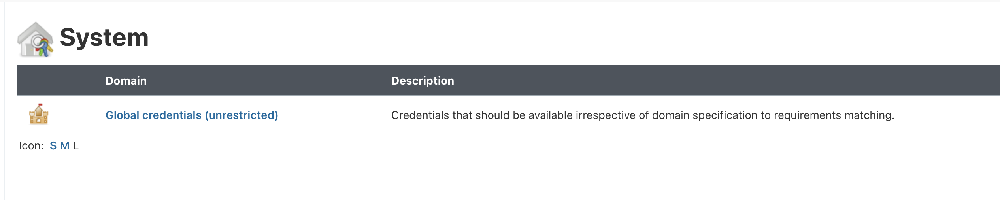

# Patient Health Records: App Modernization with Red Hat OpenShift

# Contents

- [Patient Health Records: App Modernization with Red Hat OpenShift](#patient-health-records-app-modernization-with-red-hat-openshift)
- [Contents](#contents)
- [Introduction to Health-App](#introduction-to-health-app)
  - [Example Health Background Story](#example-health-background-story)
  - [Project aims](#project-aims)
- [Health-App Hands-On!](#health-app-hands-on)
  - [1. Fork and clone this repository](#1-fork-and-clone-this-repository)
  - [2. Run Locally using Docker](#2-run-locally-using-docker)
  - [3. Manual Deploy to Openshift](#3-manual-deploy-to-openshift)
  - [4. Automate Health-UI deployment in OCP SandBox cluster using Jenkins Pipeline Strategy.](#4-automate-health-ui-deployment-in-ocp-sandbox-cluster-using-jenkins-pipeline-strategy)
    - [Create health-ui pipeline](#create-health-ui-pipeline)
    - [Create Openshift credentials](#create-openshift-credentials)
    - [Change pipeline to use a different Jenkinsfile](#change-pipeline-to-use-a-different-jenkinsfile)
  - [5. Automate Health-UI deployment in ICKS cluster using Jenkins Pipeline Strategy.](#5-automate-health-ui-deployment-in-icks-cluster-using-jenkins-pipeline-strategy)
    - [Add participants into your ICKS](#add-participants-into-your-icks)
    - [Create health-ui pipeline](#create-health-ui-pipeline-1)
    - [Create ICKS credentials](#create-icks-credentials)
    - [Change pipeline to use a different Jenkinsfile](#change-pipeline-to-use-a-different-jenkinsfile-1)
  - [6. Automate Health-UI deployment in ICKS cluster using IBM Cloud Delivery Pipelines.](#6-automate-health-ui-deployment-in-icks-cluster-using-ibm-cloud-delivery-pipelines)
    - [Create an IBM Cloud toolchain](#create-an-ibm-cloud-toolchain)
    - [Run your IBM Cloud Delivery Pipeline](#run-your-ibm-cloud-delivery-pipeline)
  - [7. Create DB and API microservice](#7-create-db-and-api-microservice)

---

# Introduction to Health-App

This project is a patient records user interface for a conceptual health records system. The UI is programmed with open standards JavaScript and modern, universal CSS, and HTML5 Canvas for layout.

The UI is served by a simple Node.JS Express server, and the overall project goals are:

- To use the project to show a step-by-step guide of deploying the app on OpenShift Source to Image (S2I). Also, we have modified the source code to integrate a Jenkins pipeline to build this image.
- To illustrate the versatility of Kubernetes based microservices for modernizing traditional applications - for instance mainframe based applications, or classic Java app server applications.
- To experiment and explore open standards front end technologies for rendering custom charts, and for responsive design.

This project has been modified to integrate automatically with a JAVA API.


---

## Example Health Background Story

Example Health is a pretend, conceptual healthcare/insurance type company. It is imagined to have been around a long time, and has 100s of thousands of patient records in an SQL database connected to an either a mainframe, or a monolithic Java backend.

The business rules for the system is written in COBOL or Java. It has some entitlement rules, prescription rules, coverage rules coded in there.

Example's health records look very similar to the health records of most insurance companies.

Here's a view a client might see when they log in:


Example Health business leaders have recently started understanding how machine learning using some patient records, might surface interesting insights that would benefit patients. There is lots of talk about this among some big data companies.

https://ai.googleblog.com/2018/05/deep-learning-for-electronic-health.html

https://blog.adafruit.com/2018/04/16/machine-learning-helps-to-grok-blood-test-results/

[ concept screenshot to come ]

Example has also heard a lot about cloud computing. There is a lot of traditional code in the mainframe and in classic Java app servers. It works well for now ... but some software architects think it may be complimentary to explore some machine learning, and to accelerate development of new user interfaces in the cloud (either public or private).

---

## Project aims

In this repo there is a patient user interface. It is written using plain HTML, CSS and JavaScript served from a Node.js microservice. The code runs by default with test/demo data, that doesn't rely on a more sophisticated server. The following installation steps can help you easily deploy this using OpenShift S2I (source to image).

---

# Health-App Hands-On!

---

## 1. Fork and clone this repository

- In the top-right corner of the page, click Fork.
  
  

- Select your organization: 
  
    

- Wait for the fork to finish, and then clone it locally following [these instructions](https://docs.github.com/en/github/creating-cloning-and-archiving-repositories/cloning-a-repository).
  
---

## 2. Run Locally using Docker

This image can be run locally using the `Dockerfile` on this repository. Make sure you have docker installed. 

1. Build the health-ui docker image using Dockerfile.
   
```
$ docker build -t health-ui .
```

2. Once the build of the image has been completed, run the container image:
```
$ docker run -d -p 8080:8080 health-ui
```

3. Open a browser and go to `http://localhost:8080`. You should be able to enter to the app.

---

## 3. Manual Deploy to Openshift

We will create a build for our docker image using s2i (source to image) component in Openshift.

1. Connect to OCP Sandbox environment:
   Login to the Openshift Master Console: 
  - Open Openshift Master Web Console: https://console-openshift-console.apps-crc.testing/dashboards
  - Go to your account name and select **Copy login command:** 
 


  - You will be requested to log in again.
  - Click on Display token, and copy the login command.


2. With the requested token, proceed with the following command to login into your shared cluster:

```.term1
oc login --server=https://api.crc.testing:6443 --token=<your-token>
```


3. Create a new project called **yourID-health-app*
  
```
  oc new-project <yourID>-health-app
```

Locate your local clone of health-ui repository and check the custom Dockerfile, which looks like the following:

```
FROM node:10-slim
RUN apt-get update && apt-get install curl -y --no-install-recommends && apt-get clean

COPY site/ /usr/src/app

WORKDIR /usr/src/app

RUN npm install -s --only=production

EXPOSE 8080

ENTRYPOINT npm start
```

With this Dockerfile, we are going to create a builder image, which will allow us to deploy health-ui:

4. The next step is to tell Openshift that we are going to create a new build with the following specs:
   1. Strategy: Docker
   2. Name: health-ui
   3. Options: 
      1. **--binary** to set the build to expect binary contents. (if using a GitHub URL this flag is not necessary)
   
  And the command should look like the following:

```
oc new-build --strategy docker --binary --name health-ui
    * A Docker build using binary input will be created
      * The resulting image will be pushed to image stream tag "health-ui:latest"
      * A binary build was created, use 'oc start-build --from-dir' to trigger a new build

--> Creating resources with label build=health-ui ...
    imagestream.image.openshift.io "health-ui" created
    buildconfig.build.openshift.io "health-ui" created
--> Success
```
As you can see in the output, Openshift lets you know that *health-ui* build will be expecting a binary input and docker strategy, and an imagestream will be created with the *health-ui* name and *latest* tag, and to start a build you will need to specify the binary file. After this information, OCP lets you know that it created two objects: 
- health-ui imagestream (is); and
- health-ui buildconfig (bc).
And everything was successful.

Let's go deeper into the objects:

5. Verify *is* (short for imagestream), has been created:

```
$ oc get is
NAME        IMAGE REPOSITORY                                                                                           TAGS     UPDATED
health-ui   default-route-openshift-image-registry.apps.shared-na46.openshift.opentlc.com/...-health-ui/health-ui   latest   X minutes ago
```

As you can see in the output, you get the basic information of health-ui imagestream object: Name, Repository (which is OCP internal repository), used tags and the time of the last update.

With *oc get resource-type* command you can display all the objects (within the project you're in) of a specific resource type, as the above usage. Try it with *bc* (buildconfig):

```
$ oc get bc
NAME        TYPE     FROM     LATEST
health-ui   Docker   Binary   1
```

As you can see in the output, you get the basic information of health-ui buildconfig object: Name, Type, From and the quantity of latest buildconfig.

6. Once you have verified these objects were created, describe them to know a bit more of each: 

```
$ oc describe is health-ui
Name:			health-ui
Namespace:		yourID-health-ui
Created:		42 minutes ago
Labels:			build=health-ui
...
```

and bc:

```
$ oc describe bc health-ui
Name:		health-ui
Namespace:	ruthgg-health-ui
Created:	49 minutes ago
Labels:		build=health-ui
...
```

Check the output of both. BuildConfig will have two interesting WebHooks which could trigger a new build if you use them, however the usage of it will not be covered in this course.

7. Start a new build with the following specifications:
   1. BuildConfig: “health-ui” 
   2. Directory: Current (Confirm that you are located at health-ui local clone where Dockerfile is located)
   3. Use **--follow** option to get logs in real time until it completes or fails.

  And the command should look like the following:

```
$ oc start-build health-ui --from-dir . --follow
Uploading directory "." as binary input for the build ...
.
Uploading finished
build.build.openshift.io/health-ui-1 started
Receiving source from STDIN as archive ...
Caching blobs under "/var/cache/blobs".

Pulling image node:10-slim ...
Getting image source signatures
Copying blob sha256 ...
...
Writing manifest to image destination
Storing signatures
Successfully pushed image-registry.openshift-image-registry.svc:5000/ruthgg-health-ui/health-ui@sha256:06c3d092cbef32a48e809f3428fa9025488b04853f7b2490d4bea21a917f7173
Push successful
```

As you can see, the directory has been uploaded and Dockerfile is being build, you can see stage by stage the output and finally the image is stored/pushed in the OCP internal registry.

This build you just saw has been executed AS A POD, and you can confirm it getting pods and checking build pod logs:

```
$ oc get pods
NAME                READY   STATUS      RESTARTS   AGE
health-ui-1-build   0/1     Completed   0          Xs
```

As you can see above, there's the pod which executed the build image procedure, and it is in “Completed” status. Compare the logs with the output you had previously, and you can see that they are the exact same:

```
$ oc logs health-ui-1-build
Caching blobs under "/var/cache/blobs".

Pulling image node:10-slim ...
Getting image source signatures
Copying blob sha256 ...
...
Writing manifest to image destination
Storing signatures
Successfully pushed image-registry.openshift-image-registry.svc:5000/ruthgg-health-ui/health-ui@sha256:06c3d092cbef32a48e809f3428fa9025488b04853f7b2490d4bea21a917f7173
Push successful
```

8. Now that we have an image with all health-ui files, let's deploy it:
Openshift provides a way to deploy applications/deployments in an easier way (a bit different from kubernetes), and this is with command *oc new-app*. With this command you can send as input a source code URL, a template or a specific image. Type *oc new-app --help* to learn more about the options and specifications.

Create a new app with the following specs:
  1. Image Name: health-ui
  2. **-e** option for environment variables (both are customizations for health-app, each app may require different specs):
     1. MODE: MODE.OPENSHIFT
     2. API_URL: http://health-api:9080/
  

 Command should look like the following:

```
$ oc new-app health-ui -e MODE="MODE.OPENSHIFT" -e API_URL="http://health-api:9080/"

--> Found image eaba12f (10 minutes old) in image stream "yourID-health-ui/health-ui" under tag "latest" for "health-ui"

--> Creating resources ...
    deployment.apps "health-ui" created
    service "health-ui" created
--> Success
    Application is not exposed. You can expose services to the outside world by executing one or more of the commands below:
     'oc expose service/health-ui' 
    Run 'oc status' to view your app.
```

9. Analyzing the output you can see OCP has created a deployment and a service, let's take a look into them:

```
$  oc get deployment
NAME        READY   UP-TO-DATE   AVAILABLE   AGE
health-ui   1/1     1            1           99s
```

and 

```
 oc get service
NAME        TYPE        CLUSTER-IP     EXTERNAL-IP   PORT(S)    AGE
health-ui   ClusterIP   172.30.4.233   <none>        8080/TCP   103s
```

For the deployment, Openshift provides the name, how many pods are ready and the total, how many are up-to-date, available and its age. 
On the other hand, for service we got its name, type of service, the cluster-ip assigned, external-ip (if existent), ports and service age.

10. Check pod logs to confirm that the application is listening on port 8080:
```
oc logs health-ui-...

> Example@1.0.0 start /usr/src/app
> node app.js

[2021-03-11T22:04:38.928] [DEBUG] default - launching Example health endpoint
[2021-03-11T22:04:38.938] [DEBUG] default - Listening on port  8080
```

11. Now that we confirmed the deployment and pod are OK, let's proceed exposing the application:
```
$oc expose service health-ui
route.route.openshift.io/health-ui exposed
```

12. Check health-ui is now available:
```
$ oc get routes
NAME        HOST/PORT                                                           PATH   SERVICES    PORT       TERMINATION   WILDCARD
health-ui   health-ui-...-health-ui.apps.shared-na46.openshift.opentlc.com             health-ui   8080-tcp                 None
```

With get command for routes, Openshift provides: Name, full route (with the host and name), path (if used), service exposed, used port, termination (if used) and Wildcard (if exists).

13. Add route to hosts file.
 - Open /etc/hosts file as per prerequisites instructions (it will depend on your OS)
 - Add the route to the line where the Sandbox environment is located:
```
9.220.50.15 <insert-your-route-here> console-openshift-console.apps-crc.testing [...]
For example:
9.220.50.15 health-ui-ruthgg-health-ui.apps-crc.testing console-openshift-console.apps-crc.testing [...]
```

14. Test your application! Go to your favorite browser and insert the route provided in command above, it should look like this:
```
health-ui-...-health-ui.apps.shared-na46.openshift.opentlc.com
```


---

## 4. Automate Health-UI deployment in OCP SandBox cluster using Jenkins Pipeline Strategy.

---

### Create health-ui pipeline

1. Ensure your Jenkins local instance is up and running at http://localhost:8080/
   
2. Click on **Open Blue Ocean** in the left menu:
   


3. Click on **Create new pipeline**:
   


4. Select **GitHub Enterprise**:
   


5. Click on **Add** to connect your new pipeline with IBM GitHub Enterprise:
   


6. Add the following fields:
* Server name: IBM
* Server URL: https://github.ibm.com/


7. You will need to provide to Jenkins a GitHub Token, click on 'Create an access token here':


It will direct you to GitHub@IBM to create it. Fill the field with a token name and leave the checks as they are setup:


Click on "Generate token":


8. Select your organization under the list (it's corresponding to your w3 ID):


9. Choose **health-ui** from repository list:


10. Click on **Create pipeline** and wait until branch indexing finishes:


### Create Openshift credentials

1. Go back to classic view on Jenkins


2. Go to **Manage Jenkins**:


3. Go to **manage credentials**:


4. Select **Jenkins** and then **Global credentials**:




5. On the left menu, select **Add credentials**:


6. Create *OCP_USER* credentials:
On the **kind** drop-down menu, select **Secret text**. Fill the fields with the following information:
- **kind:** Secret text
- **ID:** OCP_USER
- **Secret:** your w3 ID. example@mx1.ibm.com / example@ibm.com


7. In the same way, create *OCP_PASS* credentials, repeat this section to create another password with the following specs:
On the **kind** drop-down menu, select **Secret text**. Fill the fields with the following information:
- **kind:** Secret text
- **ID:** OCP_PASS
- **Secret:** your-w3-password


### Change pipeline to use a different Jenkinsfile

1. **On your local repository**, locate Jenkinsfile located at [jk/Jenkinsfile-ocp](jk/Jenkinsfile-ocp).
2. Read and understand this Jenkinsfile. In the environment variables locate *NS* variable (namespace=project) and change it to yours:
```
    NS= 'your-ocp-project'
```

3. Commit your changes and push them to your repository (ensure you are in the right location in your local machine):
```
git status
git add Jenkinsfile-ocp
git commit -m "Insert a descriptive comment on your changes here"
git push origin master
```

4. Go back to Jenkins home, and select **health-ui** pipeline, and select **Configure**:


4.1 On branch sources, set GitHub credentials (it only acceps username/password), username being your IBM w3 ID, and password your IBM GitHub token, then click Validate to see if your credentials are correct.


5. Select **Build Configuration** and change *script path* to:
```
jk/Jenkinsfile-ocp
```


Save your changes.

6. You are now ready to run your pipeline! Go to health-ui pipeline, and select **master** branch:


7. And click on **Build Now**, to follow the process, under **Build History** it will appear a new build number, click on it:


8. Check build logs clicking on **Console Output**:


9. Once your pipeline is successful, check health-ui URL. 
 


---

## 5. Automate Health-UI deployment in ICKS cluster using Jenkins Pipeline Strategy.

---

### Add participants into your ICKS

1. Go to [IBM Cloud](http://cloud.ibm.com/), ensure you are logged in your personal account.
   
2. Go to **Manage → Access (IAM)**
   


3. In the left panel, select **Users** and click on **Invite Users**.


4. Add participant(s) IDs in the box:


5. In the right panel select **Invite**


6. You should see now the user in the **Users** list, click on the user name, and click on **Access Policies**, and click on **Assign access**


7. Select **IAM services** and select **All identity and Access enabled services**


For participants assign **Editor** in Platform access, and **Writer** un Service access, and click on **Assign**


### Create health-ui pipeline

1. Ensure your Jenkins local instance is up and running at http://localhost:8080/
   
2. Click on **Open Blue Ocean** in the left menu:
   


3. Click on **Create new pipeline**:
   


4. Select **GitHub Enterprise**:
   


5. Select **IBM** GitHub Enterprise.

6. Select your organization under the list (it's corresponding to your w3 ID):


7. Choose **health-ui** from repository list:


8. Click on **Create pipeline**. It will request to configure a different name, you can name it as you like, as a suggestion, use *health-ui-icks* and wait until branch indexing finishes:


### Create ICKS credentials

1. Go back to classic view on Jenkins


2. Go to **Manage Jenkins**:


3. Go to **manage credentials**:


4. Select **Jenkins** and then **Global credentials**:


5. On the left menu, select **Add credentials**:


6. Create *ICS_PASS* credentials:
On the **kind** drop-down menu, select **Secret text**. Fill the fields with the following information:
For this credential, we will use IBM Cloud APIKEY, generated in prerequisites [here](https://github.ibm.com/DevOps-Trainings/DevOps-Bootcamp#create-an-ibm-cloud-apikey).

- **kind:** Secret text
- **ID:** ICS_PASS
- **Secret:** IBMCLOUD_APIKEY


### Change pipeline to use a different Jenkinsfile

1. **On your local repository**, locate Jenkinsfile located at [jk/Jenkinsfile-icks](jk/Jenkinsfile-icks).
2. Read and understand the Jenkinsfile, in the environment variables locate *NS* variable and change it (since in ICKS we haven't created a namespace, just add a descriptive name for your health-ui namespace, the pipeline will create it for you):
```
    ICS_NAME= 'my-cluster-name'
    NS= 'your-icks-project'
```

3. Commit your changes and push them to your repository (ensure you are in the right location in your local machine):
```
git status
git add Jenkinsfile-ocp
git commit -m "Insert a descriptive comment on your changes here"
git push origin master
```

4. Go back to Jenkins home, and select **health-ui** pipeline, and select **Configure**:


5. Select **Build Configuration** and change *script path* to:
```
jk/Jenkinsfile-icks
```


Save your changes.

6. You are now ready to run your pipeline! Go to health-ui pipeline, and select **master** branch:


7. And click on **Build Now**, to follow the process, under **Build History** it will appear a new build number, click on it:


8. Check build logs clicking on **Console Output**:


9. Once your pipeline is successful, check health-ui URL. 


---

## 6. Automate Health-UI deployment in ICKS cluster using IBM Cloud Delivery Pipelines.

### Create an IBM Cloud toolchain

1. Login to https://cloud.ibm.com/ . Check that you're in your IBM Cloud account.
   
2. Open **Navigation Menu** and click on **DevOps** option.
   
3. Click on create a new toolchain.


4. Select "Develop a Kubernetes app":


5. Fill the information as follows:

- **Toolchain Name**: *your-ID*-health-ui
- **Select Region**: Select the region where your cluster is.
- **Select a resource group**: default
- **Select a source provider**: GitHub Enterprise Whitewater
- **Select a pipeline type**: Classic


Under **Tool Integrations**:
- GitHub Enterprise Whitewater:
  - **GitHub Whitewater Server**: Whitewater GitHub Enterprise (https://github.ibm.com)
  - Check **I understand** check box.
  - **Repository type**: Existing
  - **Repository URL**: https://github.ibm.com/*your-ID*/health-ui


Under **Delivery Pipeline**:
- **App Name**: health-ui
- **IBM Cloud API Key**: Use the requested APIKEY in prerequisites.
The following fields will load automatically, change them if needed:
- **Container registry region**: Leave it as defaults.
- **Container registry namespace**: Select your namespace.
- **Cluster region**: Leave it as defaults.
- **Resource Group**: Default
- **Cluster name**: *your cluster name*
- **Cluster namespace**: *your cluster namespace*


Before clicking “Create”, verify that the toolchain name is still the one you specified, if it changed, just re-type your toolchain name.

6. Click on “Create”. Once created, your toolchain should look like the following:


### Run your IBM Cloud Delivery Pipeline

1. Now that your toolchain is ready, click on “Delivery Pipeline”.

2. Configure Build Stage: Click on the gear and select Configure Stage.
Edit the Build Script of the Fetch Code Job so the GIT_BRANCH is master.

```
echo "GIT_BRANCH=master" >> $ARCHIVE_DIR/build.properties
```
And Save your changes.


3. Configure as well the "Containerize" Stage, clicking on the gear -> Configure Stage.
Click on "Checking vulnerabilities" Job, at the end of the page, uncheck: "Stop running this stage if this job fails".
Save changes.

4. The Delivery Pipeline started as soon as you created the toolchain, follow the progress of each stage (Build, Containerize and Deploy) and each job inside them. Click on **View logs and history** to follow each action and its progress for each stage and job.
  
  

5. Wait for the delivery pipeline to finish. Once **Deploy** Stage is in Passed status, go to logs and at the end of **Deploy to kubernetes** job, you will find the URL of your app:
 


IMPORTANT NOTE: 
- If **Deploy** stage fails, click on it, then select **Containerize** stage and click on the gear → **Configure Stage**. 
- Once in **Configure Stage** for **Containerize** open **Check Registry** job, and take note that IBM Cloud region.
- Go back to **Deploy** stage and again click on gear → **Configure stage**
- Click on **Deploy to kubernetes** and IBM Cloud Region should be the same as the one configured in **Check Registry**. If not, change it to be the same.

And URL:


**Note**: Check and understand what just happened on your delivery pipeline, since all ran automatic it could be a bit mysterious how it works.

## 7. Create DB and API microservice

Now that you created Health-UI, you're ready to proceed creating and connecting health-DB and health-API. Read all the following steps before proceeding:

1. Go to [health-db](https://github.ibm.com/DevOps-Trainings/health-db) and [health-api](https://github.ibm.com/DevOps-Trainings/health-api) repositories. (Fork and clone them locally).
2. For each, go to "Manual Deployment" section, and follow the instructions to create each microservice.
3. Once you checked your DB and API are working, go back to this repository and follow the next steps.

4. We need to connect health-ui to health-api, to do so, we are going to set the following environment variables in health-ui deployment:
```
oc set env deployment/health-ui API_URL="http://health-api:9080/" -e MODE=MODE.OPENSHIFT
```

You can confirm the configuration running printenv in the health-ui pod:
```
$ oc get pods

$ oc rsh <health-ui-pod>

$ printenv
[...]
MODE=MODE.OPENSHIFT
[...]
API_URL="http://health-api:9080/"
[...]

$ exit
```

5. Try to login to health-ui URL, you can use marioh/marioh as user and password to test.


6. Once in, you'll be able to navigate in the application:

