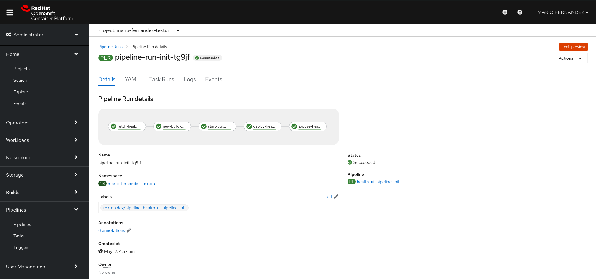
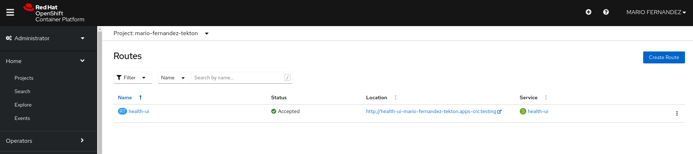
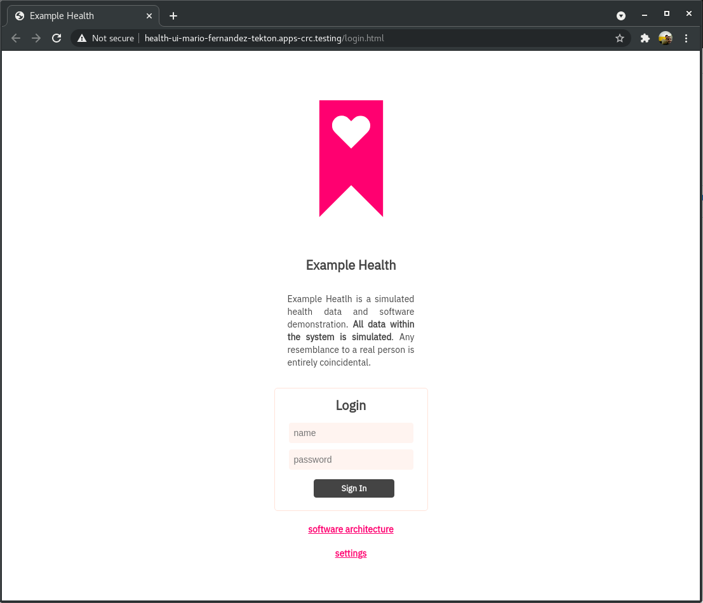
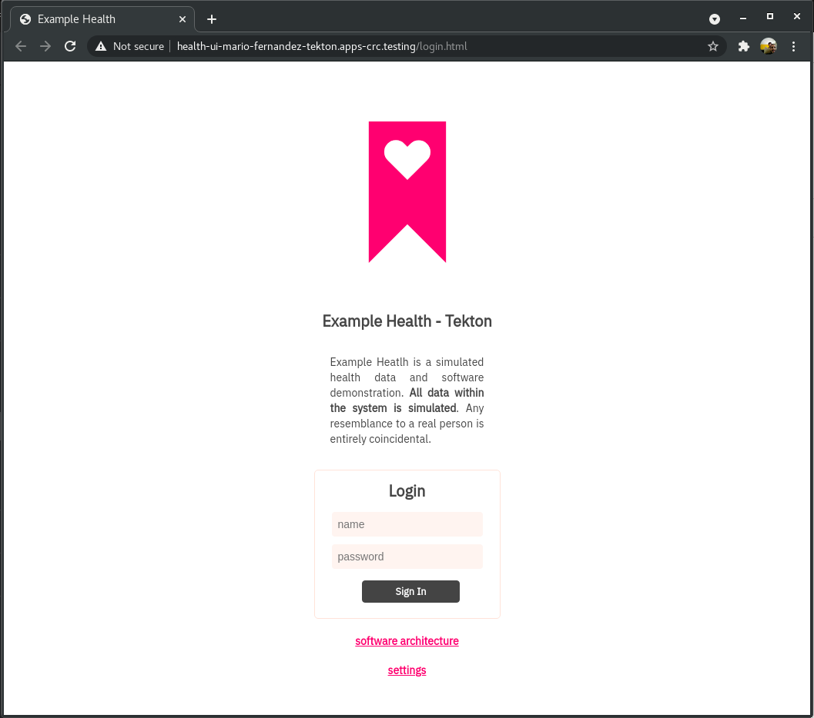

# Health-ui Tekton Pipeline

## Prerequisties

* oc CLI client

## Steps

1. Target your cluster
2. Create Project
3. Create service account and add github-secret
4. Apply pipelines and run
5. Run pipelines

### 1. Target your cluster

Login to https://console-openshift-console.apps-crc.testing. Click on the **OpenShift web console** button in the upper right.  Once on your web console, select the dropdown from the upper right corner (the label contains your email address), and select **Copy Login Command**.  Paste this into your local console window.  It should resemble:

```
oc login https://api.crc.testing:6443 --token=XXXXXXXXXXXXXXXXXXXXXXXXXX
```
Or you can use your credentials directly:

```bash
oc login https://api.crc.testing:6443 -u <your-w3-id>
```

### 2. Create Project

Create New project to run tekton pipeline separately from other health-ui deployments to avoid any issues.

```bash
oc new-project <your-id>-tekton
```

### 3. Create service account and add github-secret

To make sure the pipeline has the appropriate permissions to store images in the local OpenShift registry, we need to create a service account.  We'll call it 'pipeline':

```bash
oc create serviceaccount pipeline #This might have already created
oc adm policy add-role-to-user edit -z pipeline
```

In order to be able to pull our artifacts from github private repository we must add a secret to our Service account.

First we must obtain our token, [follow this instructions](https://docs.github.com/en/github/authenticating-to-github/creating-a-personal-access-token). The permissions needed are: ***read:user, repo, user:email, write:repo_hook***


Once we have our token ready we need to modify [git-secret.yaml](./git-secret.yaml) file with the corresponding details:

```bash
git clone https://github.ibm.com/<your-w3-id>/health-ui
cd health-ui/tekton
vi git-secret.yaml
```

```
apiVersion: v1
kind: Secret
metadata:
  name: git-secret
  annotations:
    tekton.dev/git-0: <your-github-repo ie. https://github.ibm.com/DevOps-Trainings/health-ui>
type: kubernetes.io/basic-auth
stringData:
  username: <your-w3-id>
  password: <your-github-token>
```
Create the secret:

```bash
oc create -f git-secret.yaml
```
Add this secret to your ServiceAccount:

```bash
oc secrets link pipeline git-secret
```

Validate you can see the secret listed on the SA:

```bash
oc describe sa pipeline
```
The output should look like this:

```
mario:tekton/ (master✗) $ oc describe sa pipeline
Name:                pipeline
Namespace:           mario-fernandez-tekton
Labels:              <none>
Annotations:         <none>
Image pull secrets:  pipeline-dockercfg-sh5hq
Mountable secrets:   pipeline-token-tmdhh
                     pipeline-dockercfg-sh5hq
                     git-secret
Tokens:              pipeline-token-929lb
                     pipeline-token-tmdhh
Events:              <none>
```


### 4. Apply pvc, pipelines

Pipelines use **workspaces** in order to share data among tasks of the pipeline, and this workspaces use a PVC to store this data. So we need to create PCV using bellow file.

```
oc create -f pipeline-pvc.yaml
```

Now we need to create two pipelines into the cluster.  

Initial Pipeline Definition:

[pipeline-init.yaml](./pipeline-init.yaml) this will be used for an initial run.
- **fetch-health-ui**         - This task will clone github repository.
- **new-build-health-ui**     - This task will create the BC using OC client.
- **start-build-health-ui**   - This task will start the build process to create IS from Dockerfile.
- **deploy-health-ui**        - This task will create the deployment using the IS already created.
- **expose-health-ui**        - This task will expose the service outside the cluster using a route.

Changes Pipeline Definition:

[pipeline-change.yaml](./pipeline-change.yaml) this will be used to run any consecutive runs like changes to the code.
- **fetch-health-ui**         - This task will clone github repository.
- **start-build-health-ui**   - This task will start the build process to create IS from Dockerfile. This will also trigger a new pod from the deployment since the image stream has changed.

Before creating the pipelines, we must define the corresponding github repository under the fetch-health-ui task for both **pipeline** files:

```
tasks:
- name: fetch-health-ui
  taskRef:
    name: git-clone
    kind: ClusterTask
  workspaces:
    - name: output
      workspace: shared-workspace
  params:
    - name: url
      value: <your-github-repo ie. https://github.ibm.com/DevOps-Trainings/health-ui>
    - name: subdirectory
      value: ""
    - name: deleteExisting
      value: "true"
```
Once done we can create the pipelines.

```bash
oc create -f pipeline-init.yaml
oc create -f pipeline-change.yaml
```

### 5. Run pipelines

**PipelineRun** will instantiates the pipeline and execute its tasks. For the initial run we will execute following command:

Initial run:

```bash
oc create -f pipelinerun-init.yaml
```

Once created, you can follow along with the progress of your pipeline run from the list of  **Pipelines --> Pipeline Runs** in your cluster.  Success looks similar to:



# Sample output

In your web console, navigate to **Networking --> Routes** to see the list of URLs for your applications:



Click on the URL listed for the `health-ui` to confirm installation:




Using CLI, you can try to get the pods and route:

```
mario:tekton/ (master✗) $ oc get pod
NAME                                                            READY   STATUS      RESTARTS   AGE
health-ui-1-build                                               0/1     Completed   0          16h
health-ui-c4dbff7c5-lr574                                       1/1     Running     0          16h
pipeline-run-init-tg9jf-deploy-health-ui-77rj2-pod-6xbtr        0/1     Completed   0          16h
pipeline-run-init-tg9jf-expose-health-ui-s58hv-pod-rtvj2        0/1     Completed   0          16h
pipeline-run-init-tg9jf-fetch-health-ui-m74rm-pod-nzkdx         0/1     Completed   0          16h
pipeline-run-init-tg9jf-new-build-health-ui-wc8jw-pod-8gbq8     0/1     Completed   0          16h
pipeline-run-init-tg9jf-start-build-health-ui-vktt5-pod-fxr8h   0/1     Completed   0          16h
mario:tekton/ (master✗) $ oc get route
NAME        HOST/PORT                                           PATH   SERVICES    PORT       TERMINATION   WILDCARD
health-ui   health-ui-mario-fernandez-tekton.apps-crc.testing          health-ui   8080-tcp                 None
mario:tekton/ (master✗) $                                                                                                 
```
# Subsecuent changes

New changes to application must be applied using PipelineRun **pipelinerun-changes.yaml**

Let's modify health-ui application banner.

```
cd <the path where you cloned your repo>
vim site/public/login.html
```

We will modify **Example Health** banner to something else. i.e. **Example Health - Tekton**

```
<!doctype html>
<html lang="en">
...
      <div class="Fictionalname">Example Health - Tekton</div>
...
</html>

```

Once the change was saved, we will push our changes to our github repository.

```
git add site/public/login.html
git commit -m "Changes to the Login banner"
git push origin master
```

Now, lets execute the PipelineRun (pipelinerun-change.yaml) that will instantiates the pipeline (pipeline-change.yaml) which will execute **start-build-health-ui** task. The *oc start build* command will build a new image and will trigger automatically a new pod instance of the application with the new changes.

```bash
oc create -f pipelinerun-change.yaml
```

Once finished validate route:



You want to learn more, please refer this link: [CI/CD - PIpelines](https://access.redhat.com/documentation/en-us/openshift_container_platform/4.7/html-single/cicd/index#pipelines)
